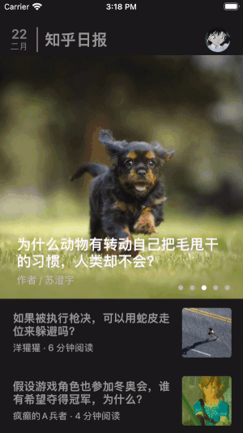
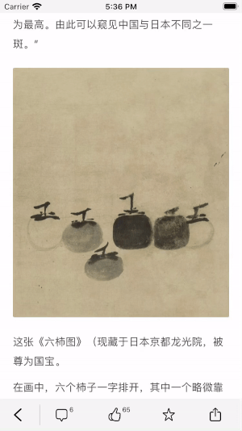
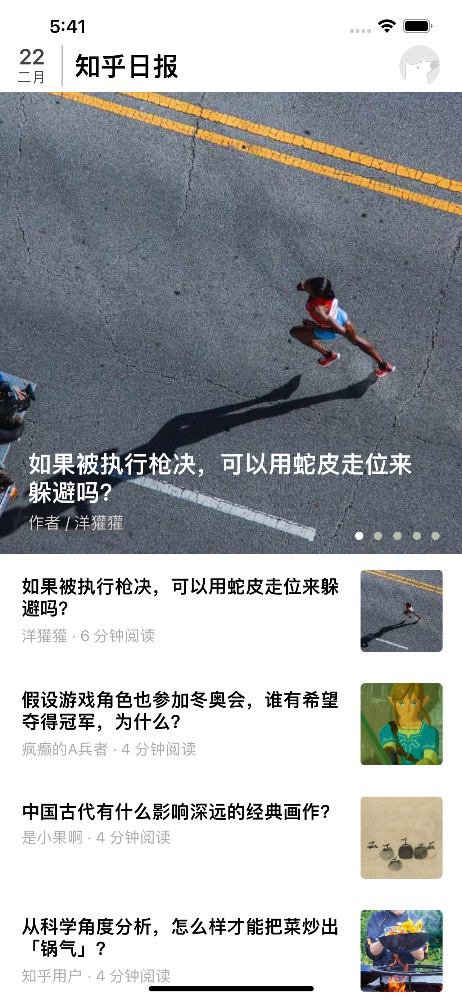
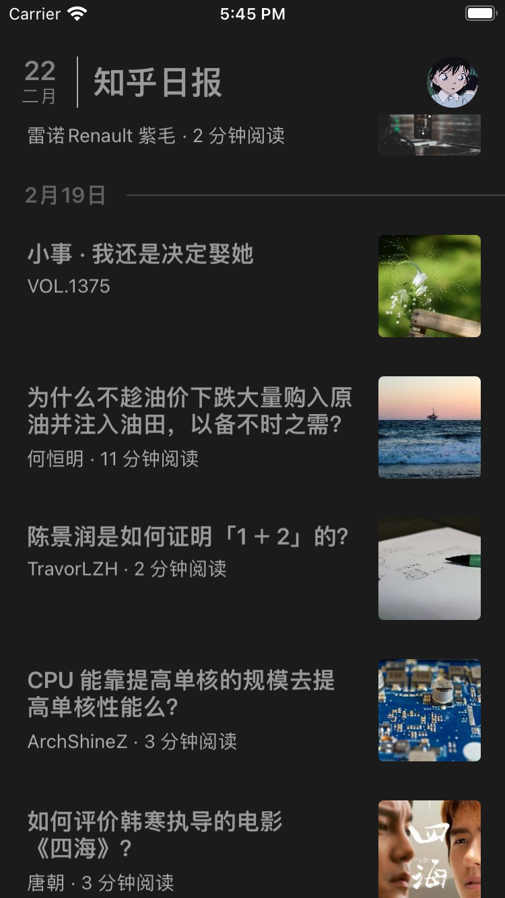
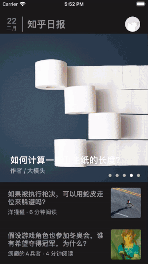
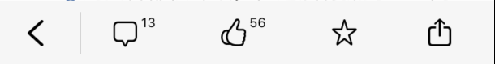

# 知乎日报

## 1 简要介绍

### 1.1 基本信息

- 制作者：宋嘉明
- 制作内容：知乎日报仿写
- 使用语言：Objective-C

### 1.2 程序架构与使用的第三方框架

- 使用MVC设计模式
- 主要使用AFNetworking第三方框架来进行网络请求
- 主要使用Masonry第三方框架来设置控件位置和实现屏幕适配

### 1.3 功能与使用步骤

- 可展示自动播放的banner，pageControl可以随着图片的滑动更改当前颜色

  

  

- 可无限上滑加载过往新闻

  

- 在同一个section请求完成，来不及加载的cell有无数据状态

  

- 点击banner或者cell可以实现新闻详情界面跳转，返回主界面后会标题会变灰

     

- 点击在新闻详情页的底部的点赞和收藏按钮可出现数字变化和提示框（会自动消失）

  

- 屏幕适配

-   iPhone8:

  ​												          

  ​							   

  iPhone 13 Pro Max:

  

  

- 黑夜模式

   
  
- 跳转到用户页与伪登陆

   
  
   

## 2 构成模块

### 2.1 HomeModular

#### Controller：

`HomeViewController`：

- **Before请求**：

  - 在Latest网络请求之前就已将View加载无数据状态，Latest网络请求在单独的一个方法里加载
  - Before请求放在代理里面，在`MainTableView`滑到每个`section`的`footerView`时触发并用代理的方式进行Before请求

- **用于处理Model数据并把它交给View来展示主界面**：

  在网络请求加载完成后去传递model数据给`MainTableView`  , `BannerView`，让它们展示界面

- **数据刷新**

  - 在开始加载主页界面的时候通过`viewWillAppear`来刷新头像
  - 在请求完Latest数据的时候就会对`MainTableView` 进行刷新
  - 请求完Before数据的时候也会对`MainTableView` 进行刷新
  - 下拉刷新

- **同时使用了代理来传递数据**：
  - **点击进入新闻详情页**：点击事件下，`MainTableView`  , `BannerView`通过代理传递`indexPath`信息给`HomeViewController`, `HomeViewController`根据传进来的indexPath找到相应的文章ID, 同样通过代理把相应ID发送给专门处理跳转事件的`ManagerViewController`, 并返回一个相应的`NewsViewController`来达到界面跳转效果
  - **点击进入个人界面**：点击事件下，`TopView`通过代理的方式告诉`HomeViewController`界面要跳转的讯息，`HomeViewController`也将用代理的方式告诉`ManagerViewController`，代理方法将会返回一个适合的个人界面
  - **刷新过往新闻**：收到`MainTableView`用代理发送过来的`section`信息，并进行过往请求，并重新加载`MainTableView`数据
  - 传递日期给每个过往新闻的`headerView`的日期
  - **banner的滚动放大效果**：`MainTableView`通过代理传递偏移量给`HomeViewController`，在由`HomeViewController`把偏移量通过代理交给`BannerView`

- **事件处理**：

  **点击TopView回到顶部**：`TopView`接到点击事件后用代理的方式告诉`HomeViewController`，`HomeViewController`使`MainTableView`回到顶部

#### View：

`TopView`：用于展示主界面顶部的不会被滑动的View，用于展示今日日期和进入个人界面

`MainTableView`：主界面重要View，继承自UITableView，用于展示新闻，与进入新闻详情页

- `BannerView`：主界面中用于自动轮播的新闻，在`MainTableView`中作为TableHeaderView
- `DateHeaderView`:  每个section的headerView，负责展示每个过往新闻的日期
- `NewsCell`:  每个新闻所在的cell，根据`MainTableView`传进来的数据作出展示

#### Model:

- `EverydayNewsModel`:  数据交换，最重要的功能是装着每天的新闻并将其传送给`HomeViewController`
- `DayModel`:  网络请求，一天的新闻，里面装着每个cell的新闻
- `DataModel`:  模块封装，具体每个cell新闻的信息

### 2.2 NewsModular

#### Controller：

`NewsViewController`：

- **网络请求**： 根据`ManagerViewController`传递进来的ID数据请求相应的网络数据
- **用于处理Model数据并把它交给View来展示主界面**：由于`WKWebView`加载界面的方式比较简单，所以没有单独为它开设一个View类，直接在请求完数据后便开始加载`WKWebView`，而新闻额外信息则是交给了`BarView`展示
- **返回主界面**：点击事件后，`BarView`通过代理使`NewsViewController`去处理返回事件

#### View：

`BarView`：

新闻底部的bar，具有返回功能，评论数与点赞数均为网络请求得来的数据，按下点赞或收藏按钮均有相应按钮图案颜色的改变，以及自定义提示框弹出与自动消失

#### Model:

`ArticleModel`:  主要去请求文章内容和新闻额外信息两个数据

### 2.3 PersonModular

#### Controller：

`PersonViewController`: 

- **展示View**：通过偏好设置判断当前应是哪个View展示
- **返回主界面**：点击事件后，`LoginView`通过代理使`PersonViewController`去处理返回事件

#### View：

`LoginView` :  由基础控件`basicView`和未登陆状态的`logInView`以及已登陆状态的`logOutView`组成

## 3 重要的技术点

- AFNetworking框架的使用与转化模型，转化成模型后的存储
- MVC模式下准确高效地把数据通过Controller交到View中并让其展示数据
- 各种界面跳转
- 使用代理进行数据传递
- Banner的自动轮播，拉伸放大
- WKWebView的⽹⻚展示
- 常用功能的封装
  - `UILabel + AutoHeight`:  能够根据文本内容，并填入一些其他值来确定该UILabel的Frame，具有屏幕适配功能
  - `NSDate + Day`:能够得到今天的day，month，也能将month的数字转化为中文

- 自定义
  - `PopAlterView`:自定义提示框，具有自动消失功能
  - `NightAndSettingButton`:  自定义UIButton，能够改变UIButton默认状态下image在左，title在右的情况，使其可做到image在上，title在下或者image在下，title在上的状态

- 伪登陆

## 4 不足与心得体会

- 不足：banner的拉伸比较奇怪

   

- 心得体会：这是第一次写一个比较完整的项目，去实现比较完整的功能，我认为这个项目很好，把大部分所学的知识都用上了，还另外给了我探索的空间，让我更深一步的知道了理论与实践的天差地别。同样，我自己也在一次次的重构与优化中看到过去不足的自己，从而静下心来去想我应该怎样去改，怎么去写的更好，怎么在已经实现了需求的情况下再去追求代码的可读性。

